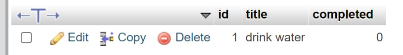

# Basic-backend-example

## Hello

Today we will learn how to create the backend that connects to the database. In this case, I will create the to-do for the demo.

## Outline

- [Prerequisite](#prerequisite)
- [Create the project folder](#create-the-project-folder)
- [What is backend](#what-is-backend)
- [Backend dependency](#backend-dependency)
  - [What is Docker and why do we use it?](#what-is-docker-and-why-do-we-use-it)
  - [Running the database](#running-the-database)
  - [Creating the table in a database](#creating-the-table-in-a-database)
- [Backend](#backend)
  - [Runtime](#runtime)
  - [TypeScript](#typescript)
  - [Setup the NodeJS project](#setup-the-nodejs-project)
  - [Integrate the project with TypeScript](#integrate-the-project-with-typescript)
  - [What is API](#what-is-api)
  - [Writing backend code](#writing-backend-code)
    - [Install Express](#install-express)
    - [Writing your first backend](#writing-your-first-backend)
    - [Connect backend with database](#connect-backend-with-database)
    - [Making a "Get todo" route](#making-a-get-todo-route)
    - [Making a "crate todo" route](#making-a-create-todo-route)
    - [Making a "delete todo" route](#making-a-delete-todo-route)
    - [Making the "update todo" route](#making-the-update-todo-route)
    - [CORS](#cors)
- [Epilogue](#epilogue)

## prerequisite

- [NodeJS](https://nodejs.org/)
- [Docker](https://www.docker.com/)
- Any HTTP client, ex: [Postman](https://www.postman.com/), [Insomnia](https://insomnia.rest/), some vs code extension. In this lab, I will use Postman for example.

## Create the project folder

First, Let's create the folder for our project. For me, I will create a folder named `todo-backend`. You can now open this folder with any code editor you like. For me, I will use [Visual Studio Code](https://code.visualstudio.com/).

## What is backend

For dead easy explanation, the backend is the layer that will process the request from any frontend like a website or mobile and respond to the frontend that the request is successful or not.

In this case, we are going to create the to-do application so if the frontend wants to set the to-do status of `go washing` to `completed` the backend will process that request from the frontend by checking that if the `go washing` things have existed in the database or not. If exists, the backend will set the database of that row to `completed` and tell the frontend that your request is fulfilled. If that thing does not exist, then tell the frontend what happened and the frontend will handle this situation later.

Before we continue to create the backend app. we must have the database to store the data first.

## Backend dependency

let's create the database first. For convenience, we will use [Docker](https://www.docker.com/) to create the database instance. In this example, we will use [MySQL](https://www.mysql.com) as a database.

### What is Docker and why do we use it?

TODO: add explanation and URL to the [Docker](https://www.docker.com/) website

### Running the database

first, let's create the docker-compose file `docker-compose.yml` and add the following content:

```yml
version: '3.8'

services:
  mysql:
    image: mysql:8.3.0
    environment:
      MYSQL_ROOT_PASSWORD: root
      MYSQL_DATABASE: todo
    ports:
      - 3306:3306 # <LOCAL_PORT>:<CONTAINER_PORT>
```

Let's break down what the file says.

- `version: '3.8'`: This is the version of the docker-compose file. This is the latest version at the time of writing.
- `services`: This is where we define the services that we want to run.
- `mysql`: This is the name of the service. You can name it anything you want.

In the `mysql` service block, we define that

- we will use the `mysql:8.3.0` **image**. ([image](https://hub.docker.com/layers/library/mysql/8.3.0/images/sha256-6d5a11994be8ca5e4cfaf4d370219f6eb6ef8fb41d57f9ed1568a93ffd5471ef?context=explore))
- we set the `MYSQL_ROOT_PASSWORD` to `root` and `MYSQL_DATABASE` to `todo`. If you want to find more about the environment variables, you can find it [here](https://hub.docker.com/_/mysql) in the section `Environment Variables`.
- we bind the `ports` so that if we access `3306` in the local machine it will bind to `3306` in the container (the left number is a local port, and the right number is the container port). Now we can access the database from port 3306.

If you have a database client you can try connecting the database by using username: `root`, password: `root` database: `todo` host: `localhost`

Don't worry if you don't have any database clients. we will use [PHPMyAdmin](https://www.phpmyadmin.net/). PHPMyAdmin is a web-based database client. However, I still recommend using a database client that is not embedded in the server. we will add this service in the `docker-compose.yml` file.

```yml
version: '3.8'

services:
  mysql:
    image: mysql:8.1.0
    environment:
      MYSQL_ROOT_PASSWORD: root
      MYSQL_DATABASE: todo
    ports:
      - 3306:3306 # <LOCAL_PORT>:<CONTAINER_PORT>

  phpmyadmin:
    image: phpmyadmin:5.2.1
    ports:
      - 8080:80
    environment:
      PMA_HOST: mysql
      PMA_USER: root
      PMA_PASSWORD: root

```

In the code above I added `phpmyadmin` service that uses the image `phpmyadmin:5.2.1` and binds port the host from `8080` to the container port `80` This means we go to <http://localhost:8080> it can connect to the PHPMyAdmin web page. (currently not, because we are not running the container)

after we finishing add the file, to run both services just this command in the terminal.

```sh
docker compose up -d
```

> `-d` is make it detached mode, all services will run in the background. For more options please visit [here](https://docs.docker.com/engine/reference/commandline/compose_up/)

After we run the command, we can ensure that all the services are running or not by opening a "Docker Desktop". (you can use CLI if you want :p)


If everything is running, now you can access PHPMyAdmin at <http://localhost:8080>.


As you can see we have the database `todo` because we define the environment `MYSQL_DATABASE: todo` in the docker-compose file that we created earlier.

### Creating the table in a database

- click the `todo` table in the side panel


- click the `SQL` button in the top section


- after that, we will use SQL to create the new database by using this query

```sql
CREATE TABLE `todos` (
  `id` int(11) NOT NULL AUTO_INCREMENT,
  `title` varchar(255) NOT NULL,
  `completed` tinyint(1) NOT NULL DEFAULT '0',
  PRIMARY KEY (`id`)
)
```


The query above will create the table name `todos`. For more information, please visit [this](https://www.w3schools.com/sql/sql_create_table.asp).

- the press `go` button, or you can press `CTRL` + `enter` on your keyboard


> We have successfully create the table `todos` as you can see in the left side bar

Now our database is ready

## Backend

There are so many technologies to create the backend. For example, the popular framework, [.net core](https://dotnet.microsoft.com/en-us/apps/aspnet), [SpringBoot](https://spring.io/projects/spring-boot) (Java), [Go (net/http)](https://pkg.go.dev/net/http), [Fiber](https://docs.gofiber.io/), [Nest](https://nestjs.com/) and so on. (there are so many that I can't type all of them)

But today we will use [Express](https://expressjs.com/) to create our to-do app. It's an easy framework to create a simple backend (and also can create more complex functionality backend too).

Express is written in JavaScript so you are required to have the basic knowledge of [JavaScript](https://developer.mozilla.org/en-US/docs/Web/JavaScript). Don't worry if you don't know anything about it. The "basic syntax" itself is simple.

### Runtime

Javascript itself is the language. But to run the JavaScript code we need the **Runtime** to run it. The reason why the browser can run the code is because it contains the runtime. For example, Chrome has the [V8](https://v8.dev/) engine, Safari has the [JavaScriptCore](https://docs.webkit.org/Deep%20Dive/JSC/JavaScriptCore.html)

But there are JavaScript runtime for the server too. The most popular one is [NodeJS](https://nodejs.org/en). But there are also [Deno](https://deno.com/), [Bun](https://bun.sh/) and much more

In this lab, we will use **NodeJS** as a JavaScript runtime.

### TypeScript

JavaScript is simple because it's a loosely typed language. It's good when creating a simple application. But when the codebase is larger, it will be harder to develop. Worst of all, the bug might appear in the production environment instead of developing one.

So this is why we have [TypeScript](https://www.typescriptlang.org/). TypeScript is JavaScript with syntax for types. (they defined itself on the homepage of their website, lol). But remember, TypeScript is a **statically typed language** which means it will check type at the time when transpile TypeScript to JavaScript only.

### Setup the NodeJS project

***If you don't care about TypeScript or NodeJS things. You can skip to this [section](#writing-backend-code).***

We will use [npm](https://www.npmjs.com/) to create a new NodeJS project. The **npm** is a [built-in NodeJS package manager](https://nodejs.org/en/learn/getting-started/an-introduction-to-the-npm-package-manager).

There are other package managers than `npm`, the popular ones are [pnPm](https://pnpm.io/) and [yarn](https://yarnpkg.com/). If you want to use other package managers you can just type `corepack enable` in your terminal. After that, you can now use `yarn` and `pnpm` in your terminal.

First, open the terminal and make sure that you are in the directory that we made earlier. and then type this command to create the new NodeJS project.

```sh
npm init # if your use npm <== we will npm as a example
yarn init # if you use yarn
pnpm init # if you use pnpm
```

After running the command, there will be a prompt to ask for the basic information for creating the new project. In this case, you can just type anything you want.

When after finishing fill in the information in the terminal. There will be a new file in our directory called `package.json`

```text
.
└── backend-todo/
    ├── docker-compose.yml
    └── package.json
```

After that, create the file name `index.js` in the project directory and then add this to the file.

```js
console.log("hello world");
```

and now your project structure should be like this

```text
.
└── backend-todo/
    ├── docker-compose.yml
    ├── package.json
    └── index.js
```

After that, in the terminal, run the `index.js` file by using this command

```sh
node index.js
```


Congratulation!!! we made the "Hello World" app in JavaScript

### Integrate the project with TypeScript

First, we rename the file from `index.js` to `index.ts` and then add this code to the `index.ts` file.

```ts
function sayHello(name: string) {
  console.log(`hello "${name}" from method sayHello`);
}

sayHello('world');
```

then run

```ts
node ./index.ts
```


It shows an error because the **node** cannot run TypeScript file directly. We must transpile TypeScript to JavaScript first. (FYI: Other JavaScript runtime, For example, [Bun](https://bun.sh/), [Deno](https://deno.com/) can run TypeScript directly)

#### Install the transpiler

So Let's install the dependency [typescript](https://www.npmjs.com/package/typescript) by running this command.

```sh
npm install -D typescript # if you using npm
pnpm install -D typescript # if you using pnpm
yarn add -D typescript # if you using yarn
```

After running the command the `package.json` will show that we have installed the 'typescript'.


```text
.
└── backend-todo/
    ├── node_modules/ 👈 [NEW FOLDER]
    ├── docker-compose.yml
    ├── index.js
    ├── package.json
    └── package-lock.json 👈 [NEW FILE]
```

What happened after installing the dependency

- the installed package will be stored in the folder `node_modules` and
- the 'lock' file will generated, this file will store the exact version of dependencies and sub-dependencies.
  - If you use `npm`, the file will be `package-lock.json`
  - If you use `yarn`, the file will be `yarn.lock`
  - If you use `pnpm`, the file will be `pnpm-lock.yaml`

After we install `typescript`, now we can use [tsc](https://www.typescriptlang.org/docs/handbook/compiler-options.html) command to transpile TypeScript to JavaScript code.

#### Transpile you first TypeScript code

Next, we will initialize the TypeScript project by typing this command

```sh
npx tsc --init # if you using npm
pnpm tsc --init # if you using pnpm
yarn tsc --init # if you using yarn
```

After running the command, the file `tsconfig.json` will be generated. This file will control the behavior of the transpiler. For more information, you can visit [here](https://www.typescriptlang.org/docs/handbook/tsconfig-json.html).

But in this example, we will use this config

```json
{
    "$schema": "https://json.schemastore.org/tsconfig",
    "compilerOptions": {
      "target": "es2022",
      "module": "node16",
      "lib": ["ES2022"],
      "moduleResolution": "Node16",
      "rootDir": ".",
      "outDir": "build",
      "allowSyntheticDefaultImports": true,
      "importHelpers": true,
      "alwaysStrict": true,
      "sourceMap": true,
      "forceConsistentCasingInFileNames": true,
      "noFallthroughCasesInSwitch": true,
      "noImplicitReturns": true,
      "noUnusedLocals": true,
      "noUnusedParameters": true,
      "noImplicitAny": false,
      "noImplicitThis": false,
      "strictNullChecks": false,
      "skipLibCheck": true,
      "baseUrl": "./",
      "paths": {
        "@/*": ["*"]
      }

    },
    "include": ["**/*", "__tests__/**/*"],
    "exclude": ["node_modules", "build"]
  }

```

When you reach this section. You will find that the code editor is alerting the error.


Because the typescript does not know the NodeJS type. So, we must install the NodeJS type first.

```sh
npm install -D @types/node # if you using npm
pnpm install -D @types/node # if you using pnpm
yarn add -D @types/node # if you using yarn
```

After that, we run this command to transpile the code

```sh
npx tsc # if you using npm
pnpm tsc # if you using pnpm
yarn tsc # if you using yarn
```

After running the command, you will see that there is a `build` folder that appears in our directory. Earlier in the `tsconfig.json` we set `"outdir": "build"` so the transpiler will output the result to a `build` folder.

And if we see the content in the folder there is an `index.js` here.

Try to run the transpiled code by running.

```sh
node build/index.js
```


> It's can run now!!!

#### More convenience with `scripts`

But it's too long to type `node build/index.js` every time you want to run the transpile code. so let's make it convenient by opening the `package.json` file.

in the first place, at the section `scripts`, there will be a config like this.

```json
"scripts": {
  "test": "echo \"Error: no test specified\" && exit 1"
},
```

let's change it to this.

```json
"scripts": {
  "build": "tsc",
  "start": "node build/index.js"
},
```

so next time if you want to transpile from TypeScript to JavaScript code. Instead of running this.

```sh
npx tsc # if you using npm
pnpm tsc # if you using pnpm
yarn tsc # if you using yarn
```

You can run this instead.

```sh
npm run build # if you using npm
pnpm build # if you using pnpm
yarn build # if you using yarn
```

And next time if you want to run the transpile code. Instead of running this.

```sh
node build/index.js
```

You can run this instead.

```sh
npm run start # if you using npm
pnpm start # if you using pnpm
yarn start # if you using yarn
```

#### Automatic re-transpile and re-run with `tsx`

But isn't that tedious that every time you change the code, you must run commands `npm run build` and `npm run start`? Let's make it more convenient.

Let's install the dependency a [tsx](https://github.com/privatenumber/tsx). This package makes you run the TypeScript file directly without transpile first. And have the [watch mode](https://github.com/privatenumber/tsx?tab=readme-ov-file#watch-mode). That means it will automatically restart an app when you make a change in the code.

To install the dependency, run this command in your terminal.

```sh
npm install -D tsx # if you using npm
pnpm install -D tsx # if you using pnpm
yarn add -D tsx # if you using yarn
```

After that try using a tsx by running this command.

```sh
npx run tsx watch . # if you using npm
pnpm tsx watch . # if you using pnpm
yarn tsx watch . # if you using yarn
```


let's make some changes to our code to ensure that watch mode is working by adding this code to the `index.ts` file.

```ts
console.log("hello world again")
```


It's working!!! but the command `npm run tsx watch .` things isn't that too long? Let's add the script in `package.json` to make it more convenient.

```diff
"scripts": {
  "build": "tsc",
  "start": "node build/index.js",
+  "dev": "tsx watch ."
},
```

So instead of running this.

```sh
npx run tsx watch . # if you using npm
pnpm tsx watch . # if you using pnpm
yarn tsx watch . # if you using yarn
```

You can just run this.

```sh
npm run dev # if you using npm
pnpm dev # if you using pnpm
yarn dev # if you using yarn
```

### What is API

Before we start writing our backend application. we must know **HOW** and **WHAT standards** the frontend and backend communicate.

TODO: writing about what is API and what is REST and the convention

### Writing backend code

If you did not set up the project from this [section](#setup-the-nodejs-project). You can use the finished setup project from the folder `start-project`.

For using the finished setup project. Just open that folder with any code editor.

After opening the folder. You must install the dependencies first by typing this in the terminal.

```sh
corepack enable # run this line if you never run this
pnpm install
```

From now on I will only use 'pnpm' as a package manager. But don't worry if you use other package managers. Because the command is similar.

Install the dependency.

```sh
npm install <PACKAGE_NAME> # if your use npm
pnpm install <PACKAGE_NAME> # if you use pnpm
yarn add <PACKAGE_NAME> # if you use yarn
```

Running the script.

```sh
npm run <SCRIPT_NAME> # if you use npm
pnpm <SCRIPT_NAME> # if you use pnpm
yarn <SCRIPT_NAME> # if you use yarn
```

#### Install express

Install [Express](https://www.npmjs.com/package/express) by using these commands.

```sh
pnpm install express
pnpm install -D @types/express
```

Then let's clear all the content in the `index.ts` and copy this code.

```ts
import express from 'express';

const app = express();

app.listen(3000, () => {
  console.log('Server is running at http://localhost:3000');
});
```


Then open your browser and go to <http://localhost:3000> and see what happened


As you can see the server responds to our browser with 'Cannot GET /' because currently, we do not handle the route '/' with a 'GET' method so let's implement to handle it.

#### Writing your first backend

To handle the route '/' with a 'GET' method add this line to the code

```diff
import express from 'express';

const app = express();

+ app.get('/', async (req, res) => {
+   return res.send('Hello world');
+ });

app.listen(3000, () => {
  console.log('Server is running at http://localhost:3000');
});
```


#### Connect backend with database

To connect our backend to the database. We must install the database client first. In this example, We will use [mysql2](https://www.npmjs.com/package/mysql2).

Install by using this command

```sh
pnpm install mysql2
```

After we install, we will initialize the database connection by adding this code in `index.ts`.

```diff
import express from 'express';
+ import mysql from "mysql2/promise";

+ const connection = await mysql.createConnection({
+   host: "localhost",
+   user: "root",
+   password: "root",
+   database: "todo",
+   port: 3306,
+ })

const app = express();
```

To ensure that our backend can connect to the database, let's modify the code by making our server.

- If the browser request 'GET' to the route '/', then retrieve all the table names of the database.
- And then respond to the above results to the client.

```diff
app.get('/', async (req, res) => {
+   const query = `SELECT table_name FROM information_schema.tables WHERE table_schema = 'todo';`
+   const results = await connection.query(query)
+
-   return res.send('Hello world')
+   return res.send(results)
});
```

save the file, and then refresh <http://localhost:3000> again.


As you can see backend shows the tables' names. So we can ensure that our backend is connected to the database.

> Tips: If you use the Chromium-based browser, you can install [JSON Formatter](https://chromewebstore.google.com/detail/json-formatter/bcjindcccaagfpapjjmafapmmgkkhgoa) to prettify the JSON response. (I think other browsers may have similar extensions that can do that too)


> much better!!!

#### Making a "get todo" route

##### Let's create example data

Before we continue, let's add some data to our database. In this example, I will use PHPMyAdmin.


> click at left panel at `todo` database


> click at `SQL` section

And then insert the data by using this query.

```sql
INSERT INTO todos (title, completed) VALUES ("drink water", 0)
```


Then press `go`


To see the result go to the side panel and click on the `todos` table in the `todo` database.


So the above query is working, and our data are in the database.

##### Continue writing the 'get todo' code

We will make the `/todo` route that if the frontend accesses with a `GET` method, it will...

- query in the table 'todos' to get all the to-do list
- response results to the frontend

Modify the `index.ts` with this code.

```diff
const connection = await mysql.createConnection({
  host: "localhost",
  user: "root",
  password: "root",
  database: "todo",
  port: 3306,
});

+ app.get('/todo', async (req, res) => {
+   const results = await connection.query('SELECT * FROM todos');
+ 
+   return res.send(results);
+ });
```

Let's save and access <http://localhost:3000/todo> in the browser.


As you can see, if we access /todo the backend will respond with results that come from querying the database, But we just want the to-do only. (There are in the first element of the outer array)

So let's modify the `index.ts`

```diff
app.get('/todo', async (req, res) => {
  const results = await connection.query('SELECT * FROM todos')

-   return res.send(results);
+   return res.send(results[0]);
});
```


> now backend only return the data that we actually want

But at this moment the data that is sent from the backend is just the plaintext. And what if we want to send anything else more than the data? let's send it as JSON by modifying the `index.ts` code.

```diff
app.get('/todo', async (req, res) => {
  const results = await connection.query('SELECT * FROM todos')

-   return res.send(results[0]);
+   return res.json({
+     data: results[0],
+     isSuccess: true,
+     message: 'Retrieve all the todo successfully'
+   });
});
```

Let's save and refresh <http://localhost:3000/todo> in the browser again.


Now, our getting todo route is done and this is our final code `index.ts` file.

```ts
import express from 'express';
import mysql from "mysql2/promise";

const app = express();

const connection = await mysql.createConnection({
  host: "localhost",
  user: "root",
  password: "root",
  database: "todo",
  port: 3306,
});

app.get('/todo', async (req, res) => {
  const results = await connection.query('SELECT * FROM todos');

  return res.json({
    data: results[0],
    isSuccess: true,
    message: 'Retrieve all the todo successfully'
  });
  return res.send(results[0]);
});

app.listen(3000, () => {
  console.log('Server is running at http://localhost:3000');
});
```

#### Making a "create todo" route

##### HTTP Client other than the browser

From the above example, we request and receive a response from the backend by using a browser. We only use a [GET](https://developer.mozilla.org/en-US/docs/Web/HTTP/Methods/GET) method. But from now on, we will use other HTTP methods. But our browser (URL search box) can only use the GET HTTP method. so we must find a new tool to request to the backend.

You can use something like [Insomnia](https://insomnia.rest/) or [Postman](https://www.postman.com/). But in this example, I will use Insomnia.

##### Continue writing the 'create todo' code

Let's make the route that creates todo from the given data.

By accessing this route, the client will request route `/todo` with the [POST](https://developer.mozilla.org/en-US/docs/Web/HTTP/Methods/POST) method.

Let's create the route by modifying the code in file `index.ts`.

```diff
app.get('/todo', async (req, res) => {
  const results = await connection.query('SELECT * FROM todos')

  return res.json({
    data: results[0],
    isSuccess: true,
    message: 'Retrieve all the todo successfully'
  })
});

+ app.post('/todo', async (req, res) => {
+     return res.json({
+       isSuccess: true,
+       message: 'POST /todo successfully',
+       data: null,
+   })
+ });
```

We will test this route by using Insomnia. Let's open it.


Press 'New HTTP Request'


Let's type `http://localhost:3000/todo` in the URL box, then change from `GET` to `POST` and then press `Send`.


> The response from the backend will show in the right panel

To make the backend have the ability to receive and parse the body data we must add the body parser middleware first.

```diff
+ app.use(express.json())
+ app.use(express.urlencoded({ extended: true }))
```

Now the express server can read the body that is sent from the frontend.

We will make the backend response the body that the frontend sent. Now modify the `index.ts` with this code.

```diff
app.post('/todo', async (req, res) => {
-   return res.json({
-     isSuccess: true,
-     message: 'POST /todo successfully',
-     data: null,
-   })

+   console.log(req.body);

+   return res.json(req.body);
});
```

Let's request to the backend again. But now we will send the `title` in the body along with the request.

Click the `Form` button and then select `Form URL Encoded`.


add the `name` and `key` input box anything you want. And then press `Send`


As you can see in Insomnia, the backend responds to the data that we sent. Let's use that data to store in a database.

```ts
app.post('/todo', async (req, res) => {
  const title = req.body.title

  const sql = 'INSERT INTO todos (title, completed) VALUES (?, ?)'
  const valuesToInsert = [title, false]

  const result = await connection.query(sql, valuesToInsert)

  return res.json({
    isSuccess: true,
    message: 'the todo has been saved into the database'
  })
});
```

Let's request again with Insomnia.


The data sent from the client is successfully saved into the database. However, the [HTTP response status code](https://developer.mozilla.org/en-US/docs/Web/HTTP/Status) is still 200 (the default response code of Express is 200). For the convention, the backend should respond with code [201](https://developer.mozilla.org/en-US/docs/Web/HTTP/Status/201) if the resource is created.


To fix this, let's modify the code again.

```diff
app.post('/todo', async (req, res) => {
  const title = req.body.title

  const sql = 'INSERT INTO todos (title, completed) VALUES (?, ?)'
  const valuesToInsert = [title, false]

  const result = await connection.query(sql, valuesToInsert)

-   return res.json({
+   return res.status(201).json({
    isSuccess: true,
    message: 'the todo has been saved into the database'
  })

});
```

Let's send the data from Insomnia again.


> Now the status code is 201

But what if we do not send anything from the frontend or Insomnia? Let's try.


The server crashes because the `title` is `null`.

Let's fix this by ensuring that the `title` is not null before saving it into the database. If the `title` is `null`, then respond to the client that the sent data is invalid.

```diff
app.post('/todo', async (req, res) => {
  const title = req.body.title

+   if (!title) {
+     return res.status(400).json({ isSuccess: false, message: 'require the body `title`' })
+   }
```

Let's run the Insomnia again.


You can see that the server is now not crashing when we send nothing to the server.

What if this route not only just wants the `title` data, but wants very much more than that? Must we have more than 100 if statements? Fortunately, no. There are many data validations in JavaScript. For example, [Zod](https://zod.dev/), [Yup](https://github.com/jquense/yup), [Joi](https://github.com/hapijs/joihttps://github.com/hapijs/joi), [TypeBox](https://github.com/sinclairzx81/typebox) and much more.

This is what the `index.ts` looks like after we finish all the above sections.

```ts
import express from 'express';
import mysql from "mysql2/promise";

const connection = await mysql.createConnection({
  host: "localhost",
  user: "root",
  password: "root",
  database: "todo",
  port: 3306,
})

const app = express();

 app.use(express.json())
 app.use(express.urlencoded({ extended: true }))

app.get('/todo', async (req, res) => {
  const results = await connection.query('SELECT * FROM todos');

  return res.json({
    data: results[0],
    isSuccess: true,
    message: 'Retrieve all the todo successfully'
  });
});

app.post('/todo', async (req, res) => {
  const title = req.body.title

  if (!title) {
    return res.status(400).json({ isSuccess: false, message: 'require the body `title`' })
  }

  const sql = 'INSERT INTO todos (title, completed) VALUES (?, ?)'
  const valuesToInsert = [title, false]

  await connection.query(sql, valuesToInsert)

  return res.status(201).json({
    isSuccess: true,
    message: 'the todo has been saved into the database'
  })
});

app.listen(3000, () => {
  console.log('Server is running at http://localhost:3000');
});
```

#### Making a "delete todo" route

We will create the route that

- the client requests to route something like `/todo/1` or `/todo/35` by any number is the id of the todo with the HTTP [DELETE](https://developer.mozilla.org/en-US/docs/Web/HTTP/Methods/DELETE) method.

- when this route is getting called. this route will validate if the id that frontend exists on the database (for preventing the SQL error)

- response success if some row has been deleted. response fails if there are some errors, or nothing is deleted.

here is the delete route

```ts
// we import more with 'RowDataPacket'
import mysql, { RowDataPacket } from "mysql2/promise";

// we want this route access by HTTP DELETE method. So, we use .delete
app.delete('/todo/:id', async (req, res) => {
  const id = req.params.id

  const selectQuery = 'SELECT * FROM todos WHERE id = ?'
  const values = [id]

  const results = await connection.query<RowDataPacket[]>(selectQuery, values)
  if (results[0].length === 0) {
    return res.status(404).json({ message: `todo id: ${id} not found`, isSuccess: false })
  }

  const deleteQuery = 'DELETE FROM todos WHERE id = ?'

  await connection.query(deleteQuery, values)

  return res.status(200).json({ message: "delete todo successfully", isSuccess: true })
})
```

If we want to access the values from that dynamic url things, we must define that dynamic value with `:`. And we can access it with `req.params`

For more information, please visit the [document](https://expressjs.com/en/guide/routing.html) in the section **Route parameters**

Then request this route with Insomnia by deleting todo id `2`.


And inspect the the tables with PHPMyAdmin again



> It's work!!!

What if we delete it again?


Looking good. It's not found because it does not exist.

#### Making the "update todo" route

Let's try writing the update route by yourself.

```ts
app.patch('/todo/:id', async (req, res) => {
  
})
```

#### CORS

At this moment when we request to the backend using Postman or Insomnia or other HTTP client, everything will be running smoothly. But if we send the request to the backend using a browser, we will find the [CORS](https://developer.mozilla.org/en-US/docs/Web/HTTP/CORS) problem.

To solve this problem, we will use [CORS middleware](https://github.com/expressjs/cors). To use this, we must install the dependency first.

```pnpm
pnpm install cors
pnpm install -D @types/cors
```

Then register the CORS middleware by modifying the code.

```diff
import express from 'express';
import mysql from "mysql2/promise";
import bodyParser from 'body-parser';
+ import cors from 'cors';

const app = express();

+ app.use(cors({
+   origin: "*",
+ }))
```

From this code, we allow all hostnames to be requested to our backend. In the real world, you should specify which hostname you will allow.

For more information, please visit the [documentation](https://expressjs.com/en/resources/middleware/cors.html).

## Epilogue

Thank you for reading!!! But don't forget that this is just an example of the backend application. In real-world applications, there is much more to concern.

You must be concerned about error handling, logging, etc. This example does not provide information about how to write clean code or look good project structure. You should explore more about this.
